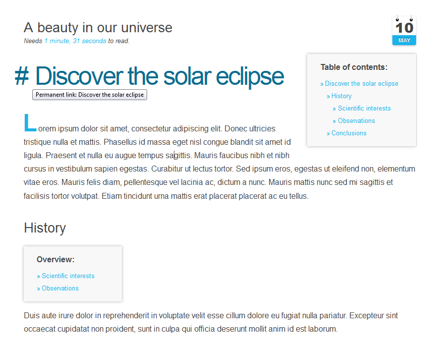

# [][project]

[][project] [][issues] [](LICENSE "License") <span style="float:right;">[][flattr] [][paypal]</span>

> This plugin automagically generates a (minified) Table of Contents based on special markers in the document and adds it into the resulting HTML document.

##### Table of Contents:

* [About](#about)
* [Installation and Updates](#installation-and-updates)
* [Usage](#usage)
    * [Twig Filter](#twig-filter)
    * [CSS Stylesheet Override](#css-stylesheet-override)
* [Contributing](#contributing)
* [License](#license)

## About

`Toc` is a plugin for [**Grav**](http://getgrav.org) used to generate Table of Contents from a Markdown document based on special markers. The markers are `[TOC]` and `[MINITOC]`, where the latter can be used for a (minified) Table of Contents to give an overview of the current content of the section. By default, the Table of Contents links to the contents (`anchorlinks`) and adds visible permanent links (`permalinks`) to all headers. Further, all headers will automatically have unique id attributes generated based upon the text of the header. See how it looks like:



## Installation and Updates

Installing or updating the `Toc` plugin can be done in one of two ways. Using the GPM (Grav Package Manager) installation update method (i.e. `bin/gpm install toc`) or manual install by downloading [this plugin](https://github.com/sommerregen/grav-plugin-toc) and extracting all plugin files to

    user/plugins/toc

For more informations, please check the [Installation and update guide](docs/INSTALL.md).

## Usage

The `Toc` plugin comes with some sensible default configuration, that are pretty self explanatory:

### Config Defaults

```yaml
# Global plugin configurations

enabled: true                # Set to false to disable this plugin completely
active: true                 # Option to (de-)activate this plugin on a page
built_in_css: true           # Use built-in CSS of the plugin

# Global and page specific configurations

title: true                  # Title to insert in the table of contents
anchorlink: true             # Set to true to cause all headers to link to themselves
permalink: true              # Set to true to generate permanent links at the beginning of each header

placement: "left"            # Either "left" or "right"
visible: "hover"             # Active on "hover" or "always" visible
icon: "#"                    # Default link or a specific character like: #, ¶, ❡, and §
class: []                    # Adds the provided classes to the anchor HTML

baselevel: 1                 # Base level for headings
headinglevel: 6              # Maximum heading level to show in TOC

slug:                        # Slug generation
  truncate: true             # Truncate headings for slug generation
  granularity: "words"       # Granularity of slug generation (based on "words" or "character")
  length: 32                 # Slug string length
  break: "-"                 # The break delimiter to divide the slug into pieces of words.
  pad: "..."                 # Added to the end of the truncated slug
```

If you need to change any value, then the best process is to copy the [toc.yaml](toc.yaml) file into your `users/config/plugins/` folder (create it if it doesn't exist), and then modify there. This will override the default settings.

If you want to alter the settings for one or a few pages only, you can do so by adding page specific configurations into your page headers, e.g.

```yaml
toc:
  permalink: false
```

to disable permalinks or

```yaml
toc: false
```

to disable the `Toc` plugin just for this page.

> Notice: The [PHP iconv module](http://php.net/manual/en/function.iconv.php) is required in order to properly convert UTF-8 titles into human readable slugs.

### Twig Filter

`Toc` provides a Twig filter to render a table of contents for any text, which uses the markers `[TOC]` or `[MINITOC]`. To do that, place the following line of code in the theme file you wish to add the Toc plugin for:

```
{{ page.content|toc }}
```

You can pass arguments to the plugin filter, namely the same arguments as available in the [toc.yaml](toc.yaml) file. For example

```
{{ page.content|toc({'permalink': false, 'baselevel': 2}) }}
```

would disable permalinks and creates a table of contents only for second-level headings and higher.

### CSS Stylesheet Override

Something you might want to do is to override the look and feel of the table of contents, and with Grav it is super easy.

Copy the stylesheet [assets/css/toc.css](assets/css/toc.css) into the `css` folder of your custom theme, modify it and add it to the list of CSS files.

    themes/custom-theme/css/toc.css

After that set the `built_in_css` option of the `Toc` plugin to `false`. That's it.

## Contributing

You can contribute at any time! Before opening any issue, please search for existing issues and review the [guidelines for contributing](docs/CONTRIBUTING.md).

After that please note:

* If you find a bug, would like to make a feature request or suggest an improvement, [please open a new issue][issues]. If you have any interesting ideas for additions to the syntax please do suggest them as well!
* Feature requests are more likely to get attention if you include a clearly described use case.
* If you wish to submit a pull request, please make again sure that your request match the [guidelines for contributing](docs/CONTRIBUTING.md) and that you keep track of adding unit tests for any new or changed functionality.

### Support and donations

If you like my project, feel free to support me via [][flattr] or by sending me some bitcoins to [**1HQdy5aBzNKNvqspiLvcmzigCq7doGfLM4**][bitcoin].

Thanks!

## License

Copyright (c) 2015-2017 [Benjamin Regler][github]. See also the list of [contributors] who participated in this project.

[Dual-licensed](LICENSE) for use under the terms of the [MIT][mit-license] or [GPLv3][gpl-license] licenses.

![GNU license - Some rights reserved][gnu]

[github]: https://github.com/sommerregen/ "GitHub account from Benjamin Regler"
[gpl-license]: http://opensource.org/licenses/GPL-3.0 "GPLv3 license"
[mit-license]: http://www.opensource.org/licenses/mit-license.php "MIT license"

[flattr]: https://flattr.com/submit/auto?user_id=Sommerregen&url=https://github.com/sommerregen/grav-plugin-toc "Flatter my GitHub project"
[paypal]: https://www.paypal.com/cgi-bin/webscr?cmd=_s-xclick&hosted_button_id=SYFNP82USG3RN "Donate for my GitHub project using PayPal"
[bitcoin]: bitcoin:1HQdy5aBzNKNvqspiLvcmzigCq7doGfLM4?label=GitHub%20project "Donate for my GitHub project using BitCoin"
[gnu]: https://upload.wikimedia.org/wikipedia/commons/thumb/3/33/License_icon-gpl-88x31.svg/88px-License_icon-gpl-88x31.svg.png "GNU license - Some rights reserved"

[project]: https://github.com/sommerregen/grav-plugin-toc
[issues]: https://github.com/sommerregen/grav-plugin-toc/issues "GitHub Issues for Grav Toc Plugin"
[contributors]: https://github.com/sommerregen/grav-plugin-toc/graphs/contributors "List of contributors of the project"
